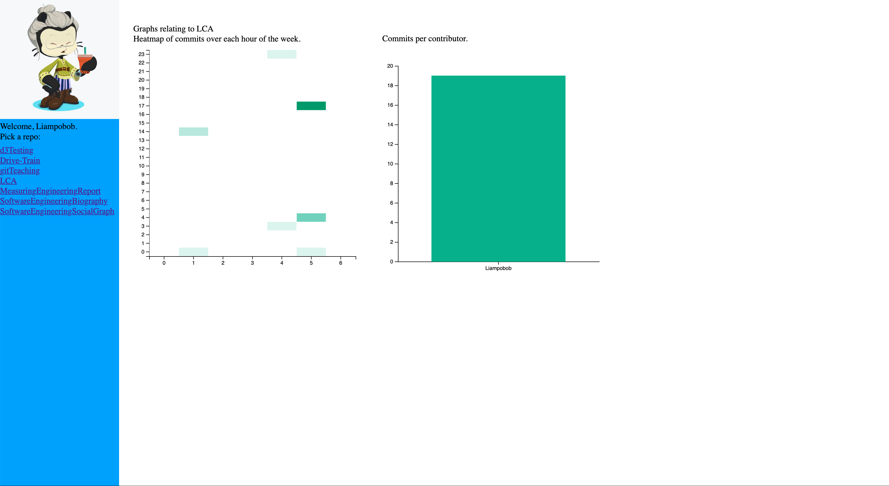
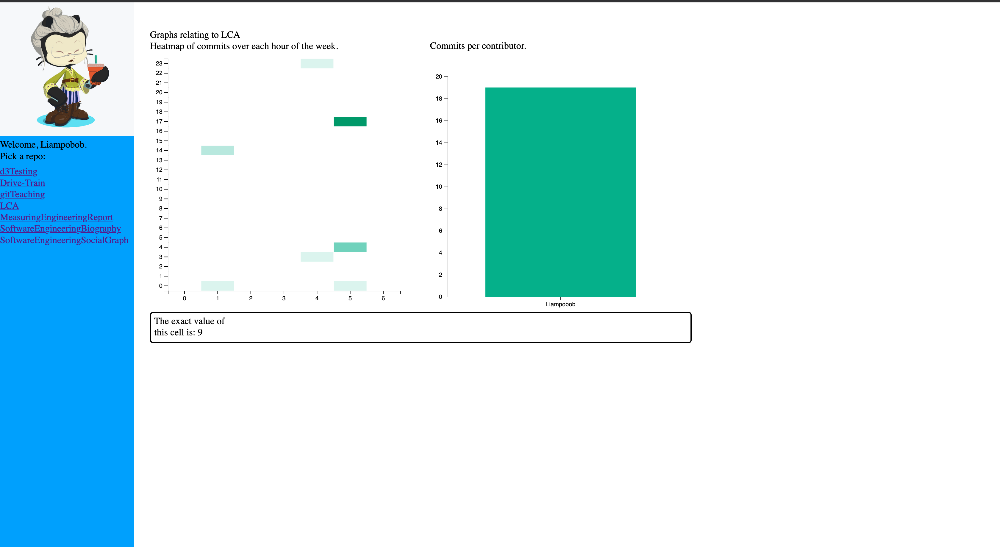
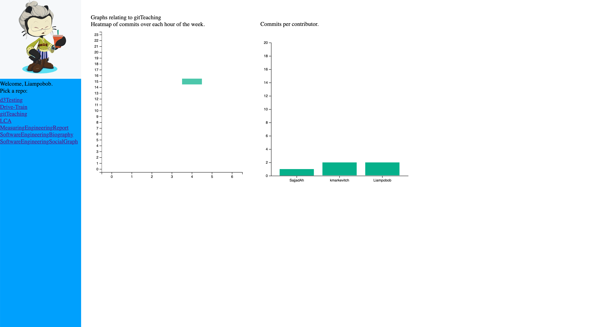
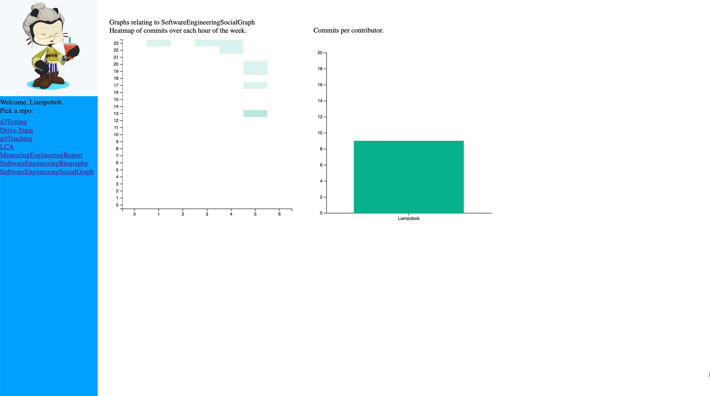

# SoftwareEngineeringSocialGraph

Student: Liam Sherlock
ID: 17308853

This application is writen in node js with an express backend alongside the github api and d3 javascript library to build data visualizations that visualy communicates the engineering process. Focusing on a selected repositories commit history.

    To run
    1. Navigate to /SoftwareEngineeringSocialGraph
    2. Run `yarn start`
    3. Navigate to http://localhost:8000/ in your browser of choice.

## Sample Workflow

### Login Page
This page simply contains a link to the github login page.

### Github Login Page
The login page redirects the user to the github login page. If the user is allready logged in then it automaticly redicects to the home page. Once the user is loged in it returnes a code in the url that is passed to the backend to be used to exchange for a user access token.

### Home Page
The home page contains some basic user information such as their avatar and username. Additionaly it lists thier repositories. In the starting state no reposity is selected by default so the right side of the application is blank. To view the graphs the user must select a repository.

### Home Page With Repo Selected
Once the user has selected a repository two graphs will appear. A heatmap containing information on what time a commit is made over the course of the week durring the projects lifetime. The second graph displaying the commits each contributor has made in the projects lifetime.

### Mouseover In Heatmap
This image displays the mouseover effect of the heatmap. With my mouse over one of the heatmap nodes it states that there have been 9 commits at 5-6 pm on friday throughout that project.

### Multiple Contributors Bar Chart
In this repository there have been multiple contributors and as such you can see how many commits each contributor has made.

### This Repo Selected
Finaly this is the visualization for this repository. 

